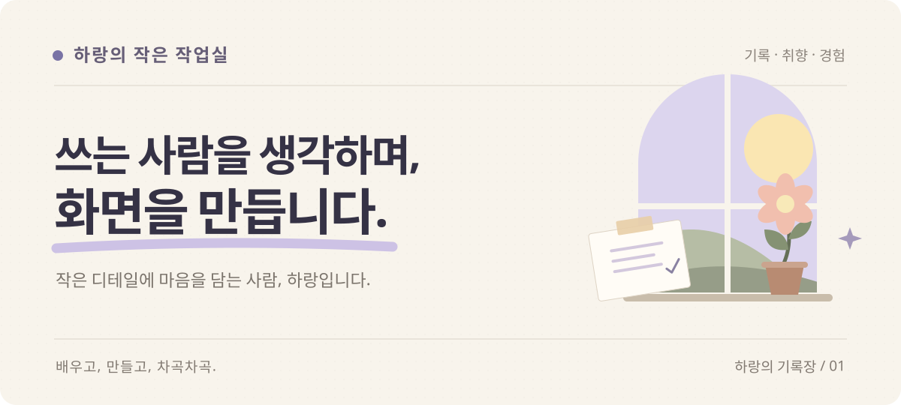
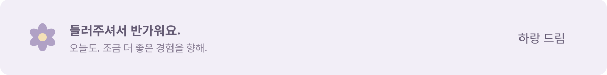

  

 

### 안녕하세요, 하랑입니다.

보기 좋은 화면에서 한 걸음 더, **쓰기 편한 경험**을 고민합니다. 서로의 생각을 잘 듣고, 함께 더 나은 방향을 찾는 일을 좋아해요.

지금은 [**알파프라임**](https://alphaprime.co.kr/)에서 프론트엔드 개발자로 일하고 있습니다.

 

[기록을 읽는 곳 ↗](https://hyunwoo-grothdiary.tistory.com/) &nbsp; · &nbsp; [기글랩 구경하기 ↗](https://giggle-lab.co.kr) &nbsp; · &nbsp; [일상 속 하랑 ↗](https://www.instagram.com/_hyunwoo_o/)

 
 

### 작은 차이를 소중하게 생각해요

**눈에 편안한 화면** 복잡한 정보도 쉽게 읽히도록, 구조와 작은 디테일을 다듬습니다.

**설명 없이도 자연스러운 경험** 다음 행동을 어렵게 고민하지 않아도 되는 흐름을 만들고 싶어요.

**함께 만드는 과정** 디자이너, 기획자, 개발자가 같은 그림을 그릴 수 있도록 먼저 듣고 이야기합니다.

 

### 만들고, 배우고, 남기는 곳

**[기글랩 ↗](https://giggle-lab.co.kr)** 만들어가는 서비스를 만나볼 수 있는 공간.

**[성장일기 ↗](https://hyunwoo-grothdiary.tistory.com/)** 배우고 고민한 내용을 차곡차곡 남기는 블로그.

**[프로젝트 모아보기 ↗](https://github.com/Harang-Dev?tab=repositories)** 직접 만들고 실험해 온 작업들.

 

### 손에 익은 도구들

React · TypeScript · Next.js · Vue JavaScript · HTML · CSS · Git · GitHub · Figma

하랑을 조금 더 알아보기

 

- 동명대학교에서 디지털미디어공학과 융합미디어를 공부했습니다.
- 제품의 화면을 구현하고, 사용 흐름과 컴포넌트를 다듬는 일에 관심이 있어요.
- 모호한 부분은 함께 구체화하고, 배운 것은 다음 작업에 담으려 합니다.

 
 

  

