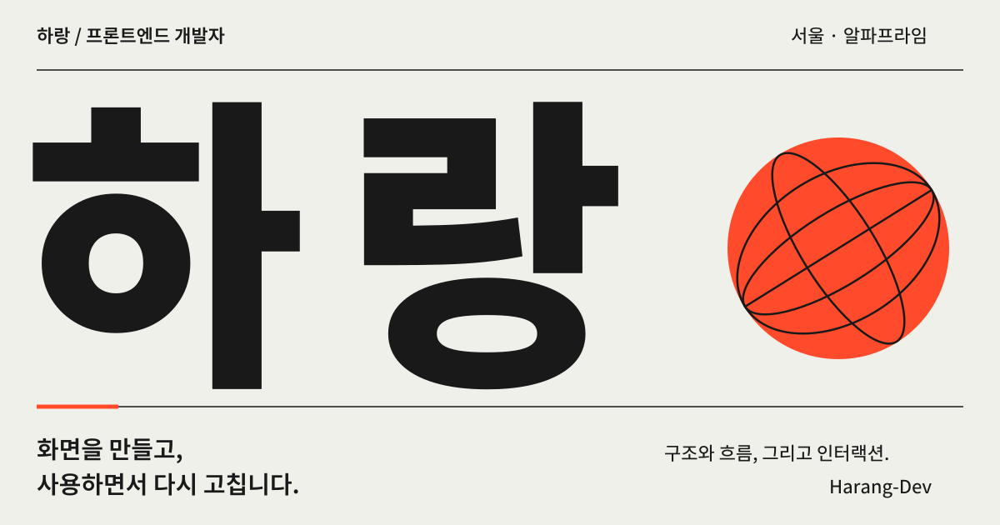
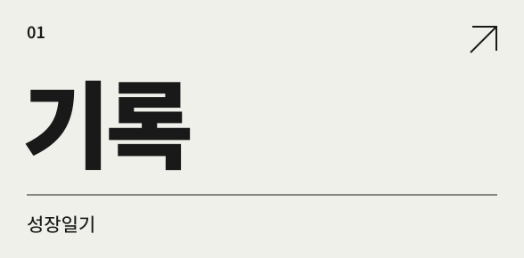
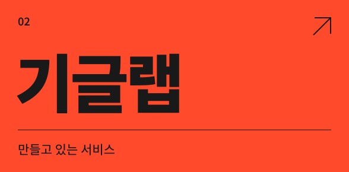

  

 

### 안녕하세요. 하랑입니다.

[알파프라임](https://alphaprime.co.kr/)에서 프론트엔드 개발자로 일합니다. 화면의 구조와 사용 흐름을 고민하고, 디자이너·기획자와 함께 제품을 만듭니다.

 

  
  

 

[프로젝트 전체 ↗](https://github.com/Harang-Dev?tab=repositories) &nbsp; / &nbsp; [인스타그램 ↗](https://www.instagram.com/_hyunwoo_o/)

 

사용하는 기술 · 이력

 

**주로 쓰는 기술** React · TypeScript · Next.js · Vue

**함께 쓰는 도구** JavaScript · HTML · CSS · Git · GitHub · Figma

**학력** 동명대학교 · 디지털미디어공학 · 융합미디어

