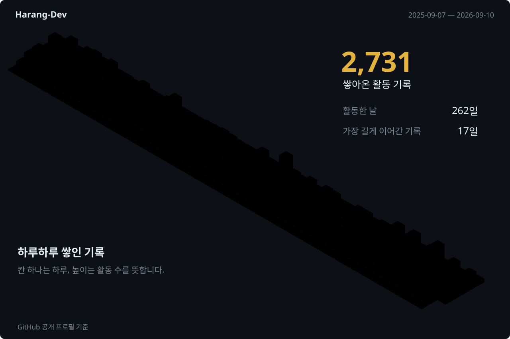

### 안녕하세요, 하랑입니다 👋

[알파프라임](https://alphaprime.co.kr/)에서 일하는 프론트엔드 개발자입니다. 화면의 구조와 사용 흐름을 고민하고, 디자이너·기획자와 함께 제품을 만듭니다.

  

자주 쓰는 도구

 &nbsp;  &nbsp;  &nbsp;  &nbsp;  
 &nbsp;  &nbsp;  &nbsp;  &nbsp; 

### 🌱 이렇게 쌓아가고 있어요

[프로젝트 전체 보기 ↗](https://github.com/Harang-Dev?tab=repositories)

### 지나온 길

<table>
  <tr>
    <td colspan="2">
      
    </td>
  </tr>
  <tr>
    <td width="50%" align="center" valign="top">
       
      <strong>동명대학교</strong> 
      디지털미디어공학 
      융합미디어 · 졸업
    </td>
    <td width="50%" align="center" valign="top">
       
      <strong>알파프라임</strong> 
      프론트엔드 개발자 
      현재 재직 중
    </td>
  </tr>
</table>

 

3D 잔디 · <a href="https://github.com/yoshi389111/github-profile-3d-contrib">github-profile-3d-contrib</a> &nbsp; / &nbsp; GIF · <a href="https://tenor.com/view/pikachu-pokemon-waving-wave-hi-gif-16091246">Tenor</a>
